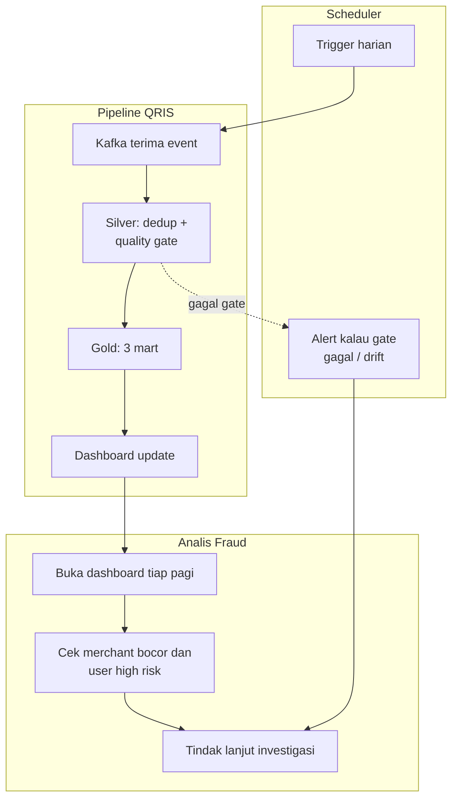

# Alur Proses (Swimlane) — siapa ngapain

```mermaid
flowchart TB
    subgraph Analis [Analis Fraud]
        A1["Buka dashboard tiap pagi"]
        A2["Cek merchant bocor dan\nuser high risk"]
        A3["Tindak lanjut investigasi"]
    end
    subgraph Sistem [Pipeline QRIS]
        S1["Kafka terima event"]
        S2["Silver: dedup +\nquality gate"]
        S3["Gold: 3 mart"]
        S4["Dashboard update"]
    end
    subgraph Scheduler [Scheduler]
        T1["Trigger harian"]
        T2["Alert kalau gate\ngagal / drift"]
    end
    A1 --> A2 --> A3
    T1 --> S1 --> S2 --> S3 --> S4 --> A1
    S2 -. "gagal gate" .-> T2 --> A3
```

Aturan baca: tiap kolom satu aktor. Panah = aliran kerja/data.
Jalur putus-putus = jalur exception (data busuk tidak lolos diam-diam,
tapi lapor).
